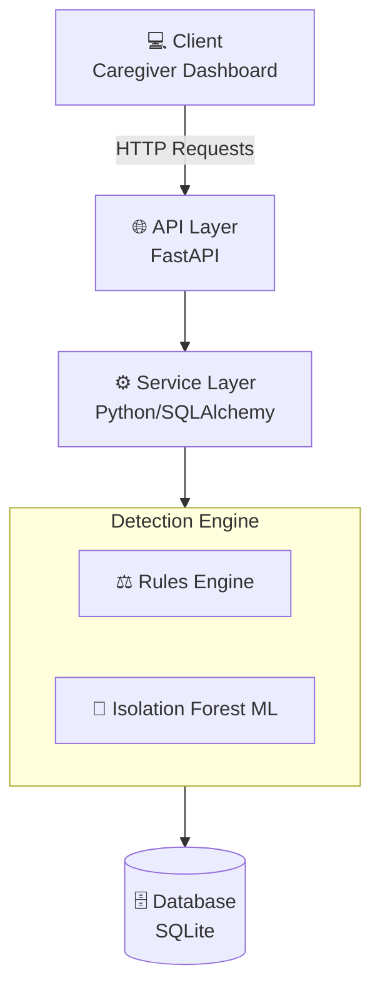

<div align="center">
  <h1>🧠 Early Dementia Routine Monitoring System (EDRMS)</h1>
  <p>
    <strong>A backend-driven healthcare system to monitor patient routines, model behaviors, and detect early signs of dementia.</strong>
  </p>
  <p>
    
    
    
    
  </p>
</div>

---

## 📖 Problem Context

Early-stage dementia is often misunderstood as primarily a memory issue. In practice, the earliest and most impactful signs are **disruptions to daily routines** (meals, sleep, medication) and **reduced consistency in behaviour patterns**. In real care settings, these issues are not detected early enough and are heavily dependent on subjective caregiver observation.

**EDRMS** addresses this by providing a robust, automated backend system that:
- 📝 Logs patient daily activities.
- 🧩 Models routine behaviour patterns.
- 🚨 Detects deviations over time using **rule-based** and **ML-based (Isolation Forest)** engines.
- 🔔 Generates actionable alerts for caregivers.

---

## 🏗️ Architecture



---

## 🚀 Setup Instructions

### Prerequisites
- **Python 3.10+**
- Basic understanding of virtual environments

### 1️⃣ Installation

1. Clone the repository and navigate to the root directory.
2. Create and activate a virtual environment:
   ```bash
   python -m venv venv
   source venv/bin/activate  # On Windows: venv\Scripts\activate
   ```
3. Install the dependencies:
   ```bash
   pip install -r requirements.txt
   ```

### 2️⃣ Running the Application

To experience the full system, you will need to open **three separate terminals** (ensure the virtual environment is activated in each).

**Terminal 1: Start the Backend API**
```bash
uvicorn app.main:app --reload
```
> The interactive API documentation (Swagger UI) is available at [http://127.0.0.1:8000/docs](http://127.0.0.1:8000/docs).

**Terminal 2: Simulate Patient Data**
```bash
python data/simulate_patient_data.py
```
> This script injects a mix of normal baseline activities and anomalous behaviors to demonstrate the detection engines.

**Terminal 3: Launch the Dashboard**
```bash
streamlit run app/dashboard.py
```
> The Streamlit dashboard will automatically open in your default web browser, providing a UI for caregivers.

---

## 💻 Example API Usage

You can easily interact with the API using `curl` or tools like Postman.

### Log a Patient Activity
```bash
curl -X 'POST' \
  'http://127.0.0.1:8000/activities/' \
  -H 'accept: application/json' \
  -H 'Content-Type: application/json' \
  -d '{
  "patient_id": 1,
  "activity_type": "medication",
  "timestamp": "2024-05-15T09:00:00Z",
  "status": "missed"
}'
```

---

## 📊 Sample Outputs

When an anomaly or missed routine is detected, an alert is generated.

**Example JSON Response:**
```json
[
  {
    "id": 1,
    "patient_id": 1,
    "alert_type": "medication_missed",
    "severity": "high",
    "message": "Patient missed scheduled medication at 2024-05-15 09:00:00",
    "timestamp": "2024-05-15T09:00:02.123456"
  }
]
```

---

## ⚠️ Limitations & Disclaimers

> [!WARNING]  
> This system is built for **demonstration and portfolio purposes only**.

- **Not Clinically Validated:** This system has not been subjected to clinical trials or medical peer review.
- **No Real-time Device Integration:** Data is currently ingested via API; it does not connect directly to IoT sensors or wearables (e.g., Apple Watch, Fitbit).
- **Simplified ML Models:** The anomaly detection uses a baseline Isolation Forest. Production systems would require more complex temporal sequence modeling.
- **No Regulatory Compliance:** This software is **NOT** compliant with medical device standards (e.g., HIPAA, GDPR for health data, FDA regulations). Do not use this with real Patient Health Information (PHI).

---

## 📬 Contact & Community

- **GitHub Discussions:** [github.com/ummaruje/dementia-routine-monitoring-api/discussions](https://github.com/ummaruje/dementia-routine-monitoring-api/discussions)
- **Email:** ummaruje@gmail.com
- **Author:** Umar Abdulkadir Isa — AI Engineer, Care Sector Portfolio

> Built with ❤️ for the 900,000 people living with dementia in the UK  
> *"The most human thing we can do with AI is notice when someone needs us — before they can ask."*
